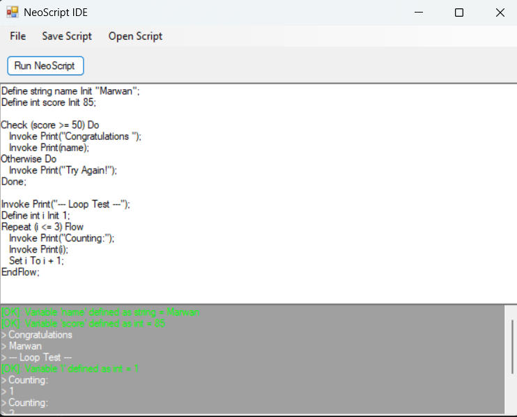

# 🚀 NeoScript IDE - محرك ومحرر لغة برمجة مخصصة

أهلاً بكم في مشروع **NeoScript**، وهو عبارة عن بيئة تطوير متكاملة (IDE) ولغة برمجة كائنية المنطق، قمت بتطويرها بالكامل باستخدام لغة **#C** وتقنيات **Windows Forms**. 

تم تصميم هذه اللغة لتبسيط مفاهيم البرمجة مع توفير مترجم (Interpreter) فوري يقوم بتحليل الكود وتنفيذه ومعالجة الأخطاء بدقة.

## 👤 المطور
* **الاسم:** مروان السقا (Marwan Elsaka)
* **التخصص:** طالب في كلية الحاسبات والمعلومات - جامعة المنصورة.
* **الدور:** مطور كامل للمشروع (Full-stack Developer & Compiler Engineer).

---

## ✨ مميزات اللغة (NeoScript Features)
تتمتع لغة NeoScript بقواعد كتابة (Syntax) فريدة ومنظمة تشمل:
- **تعريف المتغيرات:** دعم الأنواع الأساسية (int, string, bool, float) مع إمكانية التخصيص الفوري (Init).
- **العمليات الحسابية:** محرك قوي لمعالجة المعادلات الرياضية المعقدة.
- **الجمل الشرطية (Check):** تدعم منطق `Do` و `Otherwise` لاتخاذ القرارات.
- **الحلقات التكرارية (Repeat):** تكرار ذكي يعتمد على الشروط مع نظام حماية من الحلقات اللانهائية.
- **الأفعال (Actions):** إمكانية تعريف دوال مخصصة واستدعائها لاحقاً.

## 🖥️ مميزات بيئة التطوير (IDE Features)
- **محرر كود ذكي:** يعتمد على الـ RichTextBox لدعم التفاعل السلس.
- **صائد الأخطاء (Error Hunter):** نظام تلوين الأخطاء باللون الأحمر مع تحديد رقم السطر ونوع الخطأ بدقة (Syntax Error).
- **إدارة الملفات:** إمكانية حفظ الأكواد بصيغة `.neo` وفتحها مرة أخرى للتعديل.
- **واجهة عصرية:** تصميم داكن (Dark Theme) مريح للعين مع مخرجات ملونة للتميز بين رسائل النظام والنتائج.

---

## 🛠️ التقنيات المستخدمة (Technologies)
- **Language:** C# (.NET Framework/Core)
- **UI:** Windows Forms (WinForms)
- **Engine:** Regular Expressions (Regex) لعملية الـ Parsing والتحليل اللغوي.
- **Logic:** DataTable Compute API للمعالجات الرياضية.


---


## 📖 أمثلة من الكود (Code Snippets)
يمكنك كتابة كود مثل هذا في المحرر:
```neo
Define string name Init "Marwan";
Define int score Init 90;

Check (score >= 50) Do
   Invoke Print("Passed!");
Otherwise Do
   Invoke Print("Failed!");
Done;


